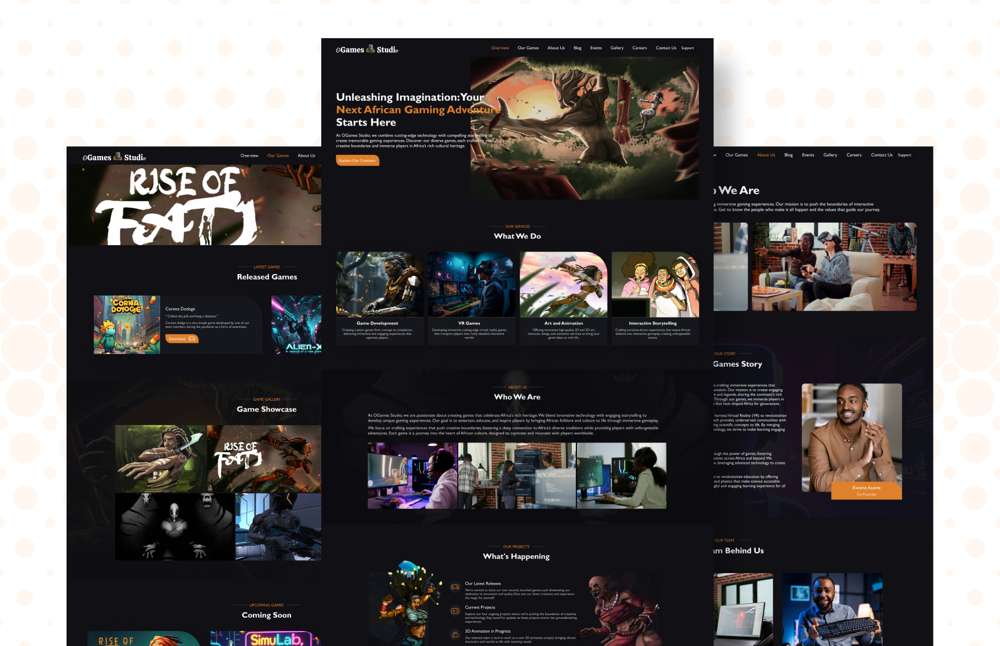

# OGames Studio Website

## About

This project involves the redesign and development of the OGames Studio website.

## Demo

 

## Technologies Used

- **HTML**: For the structure of the webpage.
- **SCSS**: For advanced styling and organization.
- **JavaScript**: For interactive features and dynamic content.
- **Figma**: For design and prototyping.

## License

MIT

## Contact

Akua Adomako Mintah - [marymintah32@gmail.com](mailto:marymintah32@gmail.com)

Project Link: [OGames-Studio](https://ogames-studio.netlify.app/)
